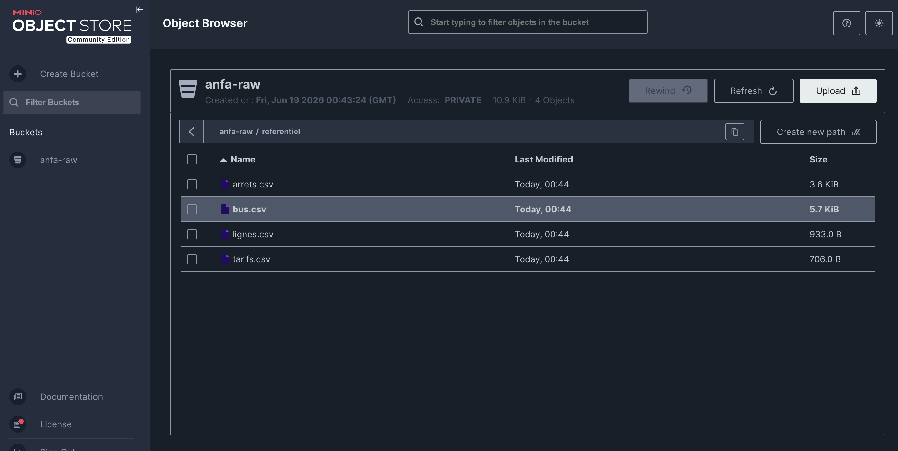

# Rendu Séance 1

**Nom et prénom :** BIKOZI Balakibawi Sylvain. 
**Identifiant GitHub :** sbk6

---

## Résumé de la séance

Cette séance avait pour objectif de poser la première brique du projet Anfa : déployer localement un service de stockage objet compatible S3 (MinIO) via Docker, puis y déposer le référentiel statique (lignes, arrêts, bus, tarifs) à l'aide d'un script Python utilisant boto3.

---

## Étapes principales

1. **Vérification de l'environnement** — Docker Desktop (v29.5.3) et Docker Compose (v5.1.4) installés et fonctionnels sur macOS M2.
2. **Fork et clonage** — Fork du dépôt `cloud-bigdata-anfa-resources`, clone local, création de la branche `seance-01`.
3. **Lancement de MinIO** — Téléchargement de l'image `minio/minio:latest`, création du volume nommé `anfa-minio-data`, démarrage du conteneur avec les ports 9000 (API S3) et 9001 (console web).
4. **Administration via mc** — Connexion au conteneur, création de l'alias `local`, création du bucket `anfa-raw`, génération de la paire de clés applicatives `anfa-app-key` / `anfa-app-secret-2026`.
5. **Script Python** — Création de l'environnement virtuel `.venv`, installation de boto3, écriture et exécution de `upload_referentiel.py` qui dépose les 4 CSV sous le préfixe `referentiel/` dans le bucket `anfa-raw`.
6. **Vérification visuelle** — Les 4 fichiers sont visibles dans la console MinIO (http://localhost:9001).
7. **Aperçu docker-compose.yml** — Création du fichier YAML équivalent à la commande `docker run`.

---

## Capture d'écran



*Console MinIO (http://localhost:9001) — bucket `anfa-raw`, préfixe `referentiel/` contenant les 4 CSV du référentiel Anfa.*

---

## Difficultés rencontrées

Aucune difficulté majeure. L'image MinIO a été téléchargée automatiquement au premier `docker run`. L'environnement virtuel Python isole bien les dépendances.

---

## Exercices d'application

### Exercice 1 : QCM conceptuel

**1.1** Réponse : **D. Open source obligatoire**

Le NIST définit 5 caractéristiques essentielles du cloud : libre-service à la demande, accès large au réseau, mutualisation des ressources, élasticité rapide, et service mesuré (pay-as-you-go). L'open source n'en fait pas partie — un fournisseur cloud peut très bien proposer des logiciels propriétaires.

---

**1.2** Réponse : **C. SaaS**

Gmail est une application complète accessible via navigateur, sans installation locale. L'utilisateur consomme un logiciel hébergé et géré entièrement par Google, ce qui correspond exactement à la définition du SaaS (Software as a Service).

---

**1.3** Réponse : **D. FaaS**

Le besoin est d'exécuter une fonction courte (vérification de cohérence GPS) déclenchée par un événement (nouvelle position), sans serveur dédié en permanence. C'est précisément le modèle FaaS (Function as a Service / serverless) : la fonction est instanciée à la demande en quelques millisecondes et ne consomme des ressources que pendant son exécution.

---

**1.4** Réponse : **C. Cloud hybride**

La banque a deux contraintes contradictoires : garder les données sensibles dans un environnement contrôlé (cloud privé ou on-premise) et bénéficier de l'élasticité cloud pour les analyses non sensibles (cloud public). Le cloud hybride combine les deux environnements, permettant de satisfaire les deux exigences simultanément.

---

**1.5** Réponse : **B. La situation où une entreprise ne peut plus changer de fournisseur sans coûts ou risques majeurs**

Le vendor lock-in désigne la dépendance forte créée par l'utilisation intensive d'APIs, de formats ou de services propriétaires d'un fournisseur, rendant la migration vers un autre fournisseur très coûteuse ou techniquement risquée.

---

**1.6** Réponse : **C. Un service open source est forcément moins performant qu'un service managé propriétaire**

Cette affirmation est fausse : des services comme Kafka, PostgreSQL ou MinIO atteignent des performances de niveau production comparables ou supérieures à bien des offres propriétaires. La performance dépend de l'architecture et du tuning, pas du statut open source ou propriétaire.

---

### Exercice 2 : Classification de services

| Service | Modèle | Justification |
|---|---|---|
| Google Compute Engine (machine virtuelle) | **IaaS** | GCE fournit des machines virtuelles brutes : l'utilisateur gère le système d'exploitation, les runtimes et les applications. C'est de l'infrastructure pure. |
| AWS Lambda | **FaaS** | Lambda exécute du code en réponse à des événements sans serveur à gérer ; la facturation est à l'invocation. |
| Snowflake (entrepôt de données) | **SaaS** | Snowflake est un entrepôt de données entièrement géré accessible via SQL/interface web, sans aucune infrastructure à administrer. |
| Heroku | **PaaS** | Heroku permet de déployer des applications en poussant du code (git push) ; la plateforme gère les runtimes, la mise à l'échelle et les dépendances. |
| Microsoft 365 (Word, Excel en ligne) | **SaaS** | Ce sont des applications bureautiques complètes utilisées depuis un navigateur, hébergées et maintenues par Microsoft. |
| Databricks (Spark managé) | **PaaS** | Databricks fournit un environnement Spark/Notebook géré ; l'utilisateur écrit son code de traitement sans administrer les clusters Spark. |
| Microsoft Azure Functions | **FaaS** | Azure Functions exécute des fonctions événementielles sans serveur, à la demande, avec facturation à l'exécution. |
| Tableau Online | **SaaS** | Tableau Online est un outil de visualisation de données hébergé et entièrement géré, accessible depuis un navigateur sans installation. |

---

### Exercice 3 : Lecture et interprétation

#### 3.1 Commande `docker run`

```bash
docker run -d --name analyse-anfa -p 8888:8888 -v /home/koffi/notebooks:/notebooks \
    -e JUPYTER_TOKEN=anfa-token \
    jupyter/pyspark-notebook
```

- **`-d`** : Lance le conteneur en arrière-plan (mode *detached*) ; le terminal est libéré immédiatement.
- **`--name analyse-anfa`** : Donne le nom `analyse-anfa` au conteneur pour pouvoir le référencer facilement (ex. `docker stop analyse-anfa`).
- **`-p 8888:8888`** : Mappe le port 8888 de l'hôte vers le port 8888 du conteneur, rendant Jupyter accessible à `http://localhost:8888` depuis la machine hôte.
- **`-v /home/koffi/notebooks:/notebooks`** : Monte le répertoire local `/home/koffi/notebooks` dans le conteneur au chemin `/notebooks`, permettant de persister les notebooks et d'y accéder depuis les deux côtés.
- **`-e JUPYTER_TOKEN=anfa-token`** : Définit la variable d'environnement `JUPYTER_TOKEN` à `anfa-token`, ce qui sera le mot de passe/token d'accès à l'interface Jupyter.
- **`jupyter/pyspark-notebook`** : Nom de l'image Docker à utiliser (image officielle Jupyter avec PySpark intégré).

**En deux phrases :** Cette commande démarre en arrière-plan un serveur Jupyter Notebook avec PySpark, accessible depuis le navigateur sur le port 8888 et protégé par le token `anfa-token`. Les notebooks créés sont sauvegardés directement dans `/home/koffi/notebooks` sur la machine hôte grâce au montage de volume.

---

#### 3.2 Lecture du `docker-compose.yml`

```yaml
services:
  minio:
    image: minio/minio:latest
    container_name: anfa-minio
    restart: always
    ports:
      - "9000:9000"
      - "9001:9001"
    environment:
      MINIO_ROOT_USER: anfa-admin
      MINIO_ROOT_PASSWORD: secret
    volumes:
      - minio-data:/data
    command: server /data --console-address":9001"

volumes:
  minio-data:
```

**a. Adresses d'accès depuis le navigateur de l'hôte :**

- `http://localhost:9000` — API S3 (utilisée par les programmes boto3, mc, etc.)
- `http://localhost:9001` — Console web d'administration MinIO

**b. Suppression du conteneur puis `docker compose up -d` :**

Les données **ne sont pas perdues**. Le volume `minio-data` est un volume Docker nommé, géré indépendamment du cycle de vie des conteneurs. Supprimer le conteneur avec `docker rm` ne supprime pas le volume. Quand `docker compose up -d` recrée le conteneur, il réattache le même volume `minio-data` qui contient les données déjà déposées.

**c. Problème de sécurité à corriger pour la production :**

Le mot de passe root `MINIO_ROOT_PASSWORD: secret` est écrit en clair dans le fichier `docker-compose.yml`. Ce fichier étant généralement versionné sur Git, ce secret serait exposé dans l'historique. Il faudrait utiliser un gestionnaire de secrets (Docker secrets, HashiCorp Vault, variables d'environnement injectées via un fichier `.env` exclu du versionnement) plutôt que de stocker le mot de passe en dur dans le YAML.

---

### Exercice 4 : Diagnostic

**a. Cause précise de l'erreur :**

Le script utilise `aws_access_key_id="anfa-admin"` et `aws_secret_access_key="anfa-password-2026"`, qui sont les **identifiants root** de MinIO. Or MinIO distingue les identifiants root (pour l'administration via la console web) des clés applicatives (service accounts créés via `mc admin user svcacct add`). L'étudiant a bien créé la clé applicative `anfa-app-key` / `anfa-app-secret-2026` via `mc`, mais son script utilise les identifiants root à la place.

**b. Correction du code :**

```python
s3 = boto3.client(
    "s3",
    endpoint_url="http://localhost:9000",
    aws_access_key_id="anfa-app-key",          # clé applicative
    aws_secret_access_key="anfa-app-secret-2026",  # secret applicatif
    region_name="us-east-1",
)
```

**c. Pourquoi MinIO refuse-t-il `anfa-admin` via l'API S3 alors qu'il fonctionne pour la console web ?**

La console web (port 9001) utilise un mécanisme d'authentification interne MinIO qui accepte les identifiants root. En revanche, l'API S3 (port 9000) implémente le protocole AWS S3 qui repose sur les **access keys** — des entités distinctes créées explicitement comme service accounts. MinIO ne mappe pas automatiquement les identifiants root sur l'API S3 pour des raisons de sécurité : cela forcerait les développeurs à utiliser des clés à moindre privilège, révocables indépendamment du compte admin.

---

### Exercice 5 : Mini-cas d'architecture

**a. Deux limites concrètes de l'architecture actuelle (PC + CSV mensuel) :**

1. **Latence de données incompatible avec le temps réel** : L'export CSV est mensuel, donc les données ont jusqu'à 30 jours de retard. Obtenir des prédictions à l'heure est structurellement impossible avec ce flux.
2. **Pas de scalabilité** : L'entraînement sur le PC portable de Toyi est limité par la RAM et le CPU d'une seule machine. Lors des pics (vendredi soir, fêtes), il est impossible d'augmenter la capacité de calcul à la demande.

**b. Caractéristiques NIST répondant aux besoins :**

| Besoin | Caractéristique NIST | Explication |
|---|---|---|
| Prédictions quasi temps réel (chaque heure) | **Élasticité rapide** | Des ressources de calcul peuvent être provisionnées en quelques secondes pour lancer un job de prédiction toutes les heures, puis libérées aussitôt. |
| Tableau de bord partagé sans installation | **Accès large au réseau** | Le cloud rend les services accessibles via des interfaces standards (navigateur web) depuis n'importe quel appareil connecté, sans installer de logiciel local. |
| Augmenter la capacité lors des pics | **Élasticité rapide** | Le cloud permet de doubler ou tripler les ressources de calcul en quelques minutes pour absorber les pics de vendredi soir, puis de les réduire après. |
| Maîtriser les coûts | **Service mesuré (pay-as-you-go)** | On ne paie que les ressources effectivement consommées ; pas de serveur qui tourne à vide la nuit ou le week-end. |
| Données clients dans un environnement contrôlé | **Mutualisation des ressources** *(cloud privé)* | Un cloud privé mutualise les ressources en interne tout en maintenant l'isolation des données dans un périmètre contrôlé. |

**c. Modèle de service pour chaque composant :**

- **(i) Tableau de bord partagé** → **SaaS** (ex. Metabase Cloud, Tableau Online, Looker) : les analystes accèdent directement via navigateur sans aucune installation ni administration de serveur.
- **(ii) Calcul des prédictions à l'heure** → **FaaS** ou **PaaS** : FaaS (ex. AWS Lambda, Google Cloud Functions) si la prédiction est légère et déclenchable par un scheduler horaire ; PaaS (ex. Databricks, Vertex AI) si le modèle nécessite plus de ressources ou un pipeline Spark.
- **(iii) Stockage des données clients** → **IaaS** ou stockage objet managé (proche de PaaS) : pour respecter la contrainte de conformité, préférer un stockage dans un environnement maîtrisé (cloud privé ou zone dédiée), par exemple un cluster MinIO on-premise ou un service S3 dans une région certifiée.

**d. Modèle de déploiement recommandé :**

Je recommande le **cloud hybride**. Les données clients sensibles (commandes, profils, historique de paiement) restent sur une infrastructure contrôlée (cloud privé ou on-premise) pour satisfaire les exigences de conformité. Les workloads élastiques — calcul des prédictions toutes les heures, rendu du tableau de bord — s'exécutent sur un cloud public pour bénéficier de l'élasticité et du pay-as-you-go. Les deux environnements sont reliés via un réseau privé sécurisé, et les données clients ne quittent jamais le périmètre contrôlé.

**e. Trois stratégies pour limiter le vendor lock-in :**

1. **Utiliser des standards ouverts et des outils open source** : adopter MinIO (compatible S3), Apache Kafka, Apache Spark — des outils qui s'exécutent identiquement sur n'importe quel cloud ou on-premise, sans dépendre d'une API propriétaire.
2. **Containeriser toutes les applications** : packager les jobs de prédiction et les services dans des images Docker standardisées, orchestrées avec Kubernetes (portable entre AWS EKS, GKE, Azure AKS ou un cluster on-premise).
3. **Adopter une architecture multi-cloud ou cloud-agnostic** : utiliser des couches d'abstraction (ex. Terraform pour l'infrastructure, des interfaces de stockage S3-compatibles) qui permettent de basculer de fournisseur sans réécrire le code applicatif.
