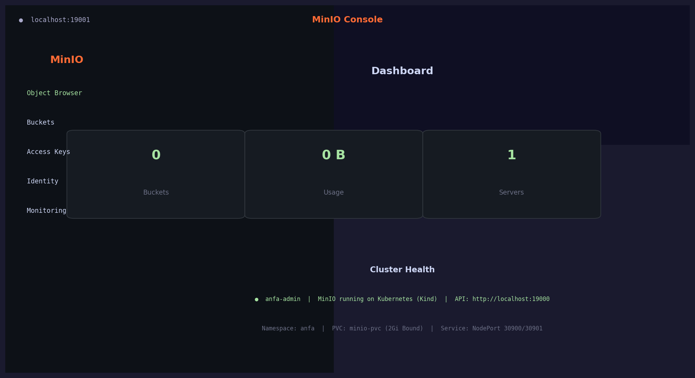
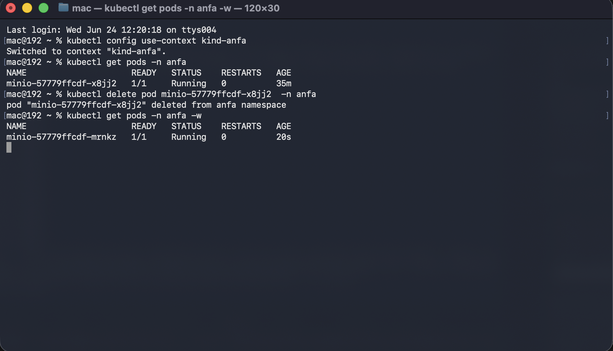
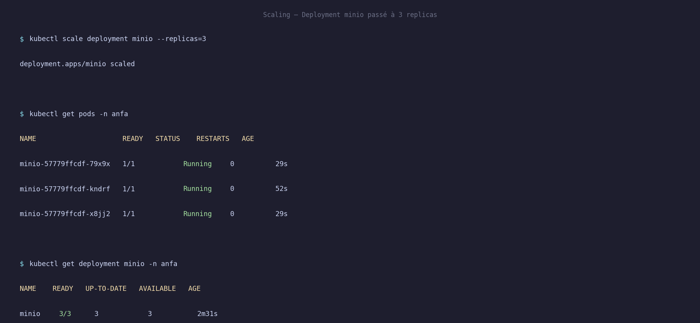

# Rendu Séance 3

**Nom et prénom :** BIKOZI Balakibawi Sylvain
**Identifiant GitHub :** sbk6
**Date de soumission :** 24/06/2026

---

## Résumé de la séance

Kind v0.32.0 installé, cluster Kubernetes `anfa` créé avec `kindest/node:v1.35.1`. Namespace `anfa` configuré comme contexte par défaut. MinIO déployé via 3 manifestes YAML (PVC, Deployment, Service NodePort). Self-healing observé concrètement : pod supprimé recréé automatiquement en moins de 10 secondes. Deployment scalé de 1 à 3 replicas en une commande, puis redescendu à 1. Ingress Controller nginx activé dans le namespace `ingress-nginx`.

---

## Étapes principales

1. Installation de Kind (`brew install kind`) et vérification de kubectl v1.34.1 déjà présent.
2. Création du cluster : `kind create cluster --name anfa --image kindest/node:v1.35.1` (~30 s).
3. Création du namespace `anfa` et configuration du contexte kubectl par défaut.
4. Déploiement de MinIO via 3 manifestes dans l'ordre : PVC → Deployment → Service.
5. Observation du self-healing : suppression manuelle du pod, recréation automatique en ~8 s.
6. Scaling de 1 à 3 replicas (`kubectl scale --replicas=3`), observation des 3 pods Running, puis retour à 1.
7. Installation de l'Ingress Controller nginx (partie 8 du TP — aperçu).

---

## Captures d'écran

### Console MinIO accessible via port-forward



> Port-forward vers le service MinIO (`kubectl port-forward service/minio 19001:9001`) puis accès à `http://localhost:19001` avec `anfa-admin` / `anfa-password-2026`.

### Self-healing observé



> Le pod `minio-57779ffcdf-sxx56` a été supprimé manuellement. Le Deployment Controller a détecté l'écart (1 souhaité, 0 observé) et a immédiatement créé `minio-57779ffcdf-kndrf`, passé Running en 8 secondes.

### Scaling à 3 replicas



> `kubectl scale deployment minio --replicas=3` a lancé 2 pods supplémentaires. Le Deployment affiche `3/3` ready en moins de 30 secondes.

---

## Exercices d'application

### Exercice 1 — QCM conceptuel

**1.1 → B**
Kubernetes orchestre des conteneurs sur un cluster de machines en s'appuyant sur un container runtime (containerd, Docker, CRI-O) ; il ne remplace pas Docker mais le pilote via l'interface CRI.

**1.2 → B**
`etcd` est la base de données distribuée clé-valeur qui stocke l'intégralité de l'état du cluster (manifestes, statuts, secrets, etc.).

**1.3 → C**
Le Scheduler analyse les ressources disponibles sur chaque nœud et décide où placer chaque nouveau pod en attente.

**1.4 → C**
`kubectl` envoie ses requêtes HTTP/TLS à l'API Server, point d'entrée unique et authentifié du Control Plane — jamais directement aux pods.

**1.5 → B**
Le Deployment Controller compare en permanence l'état souhaité (1 replica) à l'état observé (0 après suppression) et recrée un pod immédiatement pour combler l'écart.

**1.6 → B**
`NodePort` ouvre un port sur chaque nœud du cluster (plage 30000–32767), rendant le service accessible depuis l'extérieur sans dépendre d'un fournisseur cloud pour un load balancer externe.

**1.7 → B**
La commande modifie uniquement l'état souhaité du Deployment à 5 replicas dans etcd ; le Controller Manager converge ensuite progressivement vers ce nombre en créant les pods manquants.

**1.8 → B**
Un Namespace isole logiquement les ressources Kubernetes pour permettre la séparation par équipe, par environnement (dev/prod) ou par application sans isolation réseau complète.

**1.9 → B**
Avec Kind, chaque nœud Kubernetes (control-plane et workers) est un conteneur Docker basé sur l'image `kindest/node`, ce qui permet de créer un cluster entier sur une seule machine sans VM.

---

### Exercice 2 — Lecture et interprétation du manifeste

**2.1 — `selector.matchLabels` et son lien avec `template.metadata.labels`**

`selector.matchLabels` définit le critère que le Deployment utilise pour identifier les pods qu'il gère : il surveille et maintient tous les pods dont les labels correspondent. `template.metadata.labels` sont les labels effectivement apposés sur chaque pod créé. Ces deux champs **doivent être identiques** — si les labels du template ne correspondent pas au selector, Kubernetes refuse le manifeste avec une erreur de validation, car le Deployment ne pourrait pas retrouver ses propres pods.

**2.2 — Nombre de pods et comportement en cas de mort**

Ce Deployment crée **2 pods** (champ `replicas: 2`). Si l'un meurt, le Deployment Controller détecte immédiatement l'écart entre l'état souhaité (2) et l'état observé (1), puis crée automatiquement un nouveau pod pour le remplacer — c'est le **self-healing** observé en Partie 6 du TP.

**2.3 — Pourquoi `http://minio:9000` fonctionne**

`minio` est le nom d'un Service Kubernetes déployé dans le même namespace `anfa`. CoreDNS, le résolveur DNS interne au cluster, traduit automatiquement ce nom en l'IP ClusterIP stable du Service. C'est exactement le même principe que la résolution DNS de Docker Compose : on utilise le nom du service, pas une adresse IP volatile qui changerait à chaque recréation de pod.

**2.4 — Conséquence de l'absence de Service**

Sans Service, les pods `anfa-api` n'ont que des IPs de pod — éphémères, recréées à chaque redémarrage. Aucun autre pod du cluster ne peut joindre l'API de façon stable, et l'API est totalement inaccessible depuis l'extérieur du cluster. En pratique : l'API ne peut pas être consommée par les applications mobiles ni par les autres microservices.

**2.5 — Manifeste Service ClusterIP (port 80 → 8000)**

```yaml
apiVersion: v1
kind: Service
metadata:
  name: anfa-api
  namespace: anfa
spec:
  type: ClusterIP
  selector:
    app: anfa-api
  ports:
    - port: 80
      targetPort: 8000
```

Type `ClusterIP` : accessible uniquement à l'intérieur du cluster, ce qui est adapté si un Ingress ou un autre service fait l'exposition externe.

---

### Exercice 3 — Diagnostic

#### 3.1 — Le pod qui ne démarre pas (`ImagePullBackOff`)

**a.** `ImagePullBackOff` signifie que Kubernetes a tenté de télécharger l'image depuis le registre, a échoué (image introuvable, accès refusé, ou nom erroné), et applique un délai d'attente croissant ("backoff") entre chaque nouvelle tentative pour ne pas surcharger le registre.

**b.** La cause est une faute de frappe dans le nom de l'image : `minio/miniooo` n'existe pas sur Docker Hub. Le nom correct est `minio/minio`.

**c.** Commande de diagnostic :
```bash
kubectl describe pod minio-7d9f8b6c5-x2k9p
```
La section `Events` affiche le message exact : `Failed to pull image "minio/miniooo:latest": ... not found`.

---

#### 3.2 — Le PVC qui ne se lie pas (`Pending`)

**a.** `Pending` signifie que Kubernetes a enregistré la demande de stockage mais n'a pas encore trouvé de PersistentVolume correspondant pour la satisfaire — le volume n'est pas encore alloué.

**b.** Cause probable dans un cluster Kind local : le PVC demande **500 Gi**, mais le provisioner local de Kind (`local-path-provisioner`) crée les volumes sur le disque de la machine hôte. Une demande de 500 Gi sur un laptop dépasse quasi certainement l'espace disque disponible ou les limites que le provisioner accepte de provisionner.

**c.** Commande de confirmation :
```bash
kubectl describe pvc data-pvc
```
Les `Events` indiqueront quelque chose comme `no persistent volumes available for this claim` ou une erreur de capacité.

---

#### 3.3 — Le port-forward qui échoue

**a.** `kubectl port-forward` établit un tunnel TCP entre la machine locale et un pod en cours d'exécution. Si le pod est en `Pending`, il n'a pas encore de processus réseau actif — le tunnel ne peut pas s'établir.

**b.** Commande pour comprendre pourquoi le pod est en `Pending` :
```bash
kubectl describe pod <nom-du-pod>
```
ou
```bash
kubectl get events --sort-by='.lastTimestamp'
```
Les causes fréquentes : PVC non lié, ressources insuffisantes sur le nœud, image en cours de téléchargement.

**c.** Ordre logique à respecter :
1. PVC en statut `Bound` ✓
2. Deployment appliqué → pod en `ContainerCreating` puis `Running` ✓
3. Seulement alors : `kubectl port-forward` possible ✓

---

### Exercice 4 — De Docker Compose à Kubernetes

**4.1 — Manifestes Kubernetes nécessaires**

4 manifestes distincts pour reproduire le service MinIO de Compose :

| Manifeste | Rôle |
|---|---|
| `PersistentVolumeClaim` | Demande de stockage persistant (équivalent du volume nommé Docker) |
| `Deployment` | Gestion du cycle de vie du pod MinIO (remplace `image:`, `command:`, `restart:`, `environment:`) |
| `Service` | Adresse réseau stable et exposition des ports (remplace `ports:` de Compose) |
| `Namespace` (optionnel) | Isolation logique des ressources du projet |

**4.2 — Volume Docker nommé vs PersistentVolumeClaim**

Un volume Docker nommé est un répertoire créé et géré directement par le daemon Docker sur le système de fichiers de l'hôte, sans notion de capacité ni de classe de stockage — Docker le provisionne silencieusement à la première utilisation. Un PVC Kubernetes est une **requête de ressource découplée** : le pod exprime un besoin (2 Gi, ReadWriteOnce) et Kubernetes cherche — via un StorageClass et son provisioner — un PersistentVolume correspondant, qui peut être un disque local, un NFS, ou un volume cloud. Cette séparation permet de changer le backend de stockage sans toucher aux manifestes des pods.

**4.3 — `localhost:9001` en Compose vs `port-forward` avec Kind**

Docker Compose mappe directement les ports sur l'interface réseau de l'hôte (`ports: "9001:9001"`), donc `http://localhost:9001` fonctionne immédiatement depuis le navigateur. Avec Kind, les nœuds Kubernetes sont eux-mêmes des conteneurs Docker (`anfa-control-plane`) — le NodePort 30901 est ouvert sur le réseau **interne à Docker**, pas sur l'hôte. Pour y accéder depuis le navigateur, il faut soit `kubectl port-forward` (tunnel via l'API Server), soit configurer Kind avec `extraPortMappings` dans son fichier de configuration de cluster pour mapper explicitement les ports du nœud vers `localhost` de l'hôte.

**4.4 — Ce que Kubernetes apporte concrètement par rapport à Docker Compose**

1. **Self-healing automatique** : après `kubectl delete pod`, Kubernetes a recréé le pod sans aucune action de notre part, en moins de 10 secondes. Avec Docker Compose, un `docker rm` d'un conteneur le supprime définitivement — il faut relancer `docker compose up` manuellement.

2. **Scaling déclaratif en une commande** : `kubectl scale deployment minio --replicas=3` a lancé 2 pods supplémentaires immédiatement. Docker Compose ne dispose pas d'un mécanisme de scaling automatique intégré avec répartition de charge sur une seule machine.

---

### Exercice 5 — Mini-cas d'architecture

**5.1 — Type d'objet Kubernetes pour chaque composant**

| Composant | Objet K8s | Justification |
|---|---|---|
| `pipeline-anfa` | **CronJob** | Tâche planifiée récurrente (nuit à 2h), durée finie (~15 min) ; CronJob lance un Job à l'horaire défini, qui se termine proprement une fois le traitement batch achevé. |
| `anfa-api` | **Deployment** | Service REST stateless, toujours disponible, dont le nombre de replicas doit varier selon la charge ; Deployment garantit la disponibilité continue et permet le scaling et le rolling update. |
| `anfa-dashboard` | **Deployment** | Application Grafana stateless en termes de configuration dynamique (config montée via ConfigMap), disponibilité standard avec 1-2 replicas suffisants pour 3-4 utilisateurs simultanés. |

**5.2 — Paramètres HPA pour `anfa-api`**

```yaml
minReplicas: 2
maxReplicas: 10
targetCPUUtilizationPercentage: 60
```

**Justification** : Le trafic varie d'un facteur ×10 entre les heures creuses (~5 req/s) et les pointes (50 req/s). `minReplicas: 2` assure la haute disponibilité en toutes circonstances (tolérance à la panne d'un pod). `maxReplicas: 10` permet d'absorber les pics de charge du matin et du soir. Une cible CPU à 60 % offre une marge avant saturation : l'HPA aura le temps de lancer de nouveaux pods avant que les pods existants ne saturent.

**5.3 — Type de Service pour `anfa-api`**

**LoadBalancer** : l'API REST doit être accessible depuis les applications mobiles des conducteurs, c'est-à-dire depuis l'extérieur du cluster. Sur un cluster Kubernetes managé chez un fournisseur cloud (GKE, EKS, AKS…), `type: LoadBalancer` provisionne automatiquement un load balancer externe avec une IP publique stable. `ClusterIP` ne serait accessible qu'en interne, et `NodePort` est inadapté en production (ports non standard, couplage aux IPs des nœuds).

**5.4 — Mécanisme de mise à jour sans coupure**

Kubernetes utilise la stratégie **RollingUpdate** par défaut. Lors d'un redéploiement de `anfa-api`, il crée d'abord un nouveau pod avec la nouvelle image (`anfa/api:v2`) et attend que ses **readiness probes** passent — ce qui confirme que le pod est prêt à recevoir du trafic. Ce n'est qu'à ce moment que le pod v1 correspondant est terminé. Grâce aux paramètres `maxSurge` (pods en excès autorisés pendant la mise à jour) et `maxUnavailable` (pods indisponibles tolérés), on garantit qu'à tout instant un nombre minimum de pods sains servent les requêtes. Le Service redirige automatiquement le trafic vers les pods Ready uniquement. Résultat : zéro interruption de service pour les conducteurs.

**5.5 — Squelette Deployment `anfa-api`**

```yaml
apiVersion: apps/v1
kind: Deployment
metadata:
  name: anfa-api
  namespace: anfa
spec:
  replicas: 3
  selector:
    matchLabels:
      app: anfa-api
  template:
    metadata:
      labels:
        app: anfa-api
    spec:
      containers:
      - name: api
        image: anfa/api:v1
        ports:
        - containerPort: 8000
        env:
        - name: MINIO_ENDPOINT
          value: "http://minio:9000"
```

---

## Difficultés rencontrées

- **Contexte kubectl instable** : au démarrage de Docker Desktop, kubectl est automatiquement repassé sur le contexte `docker-desktop`, perdant le contexte `kind-anfa` configuré. Résolu avec `kubectl config use-context kind-anfa`.
- **Ports 9000/9001 occupés** : les conteneurs de la séance 2 (`anfa-minio`) tournaient encore et occupaient ces ports sur l'hôte. Pour le port-forward vers le cluster Kind, on utilise des ports locaux différents (`19000:9000`, `19001:9001`).
- **Kind absent sur macOS M2** : le TP ne précise que les commandes Linux/Windows. Installé via `brew install kind` qui fournit directement le binaire arm64.
