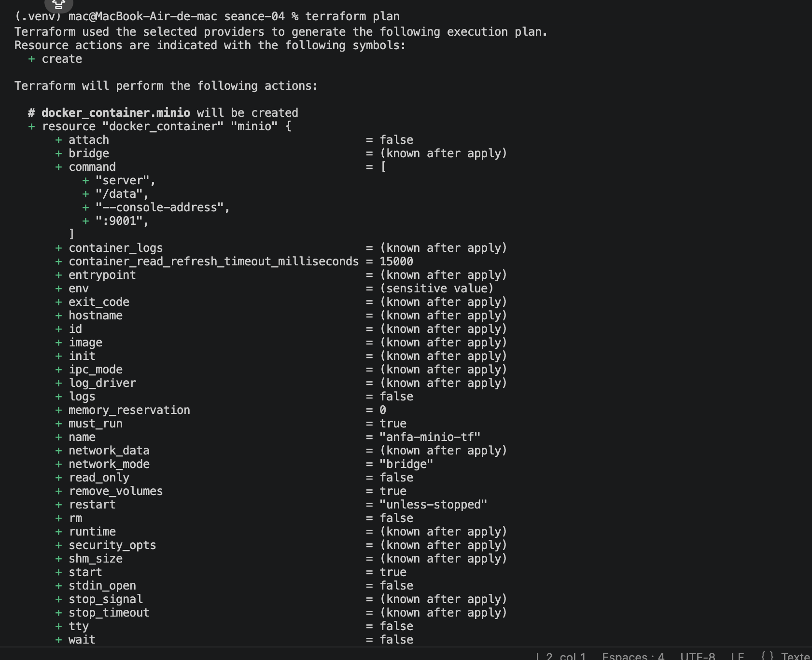
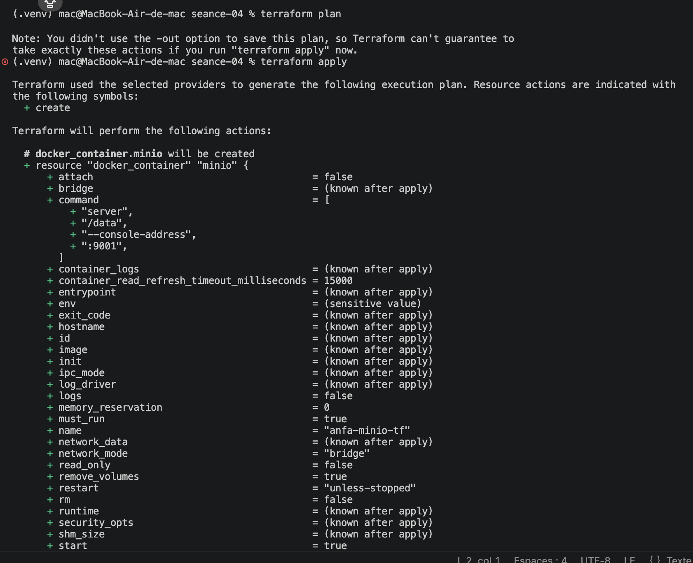
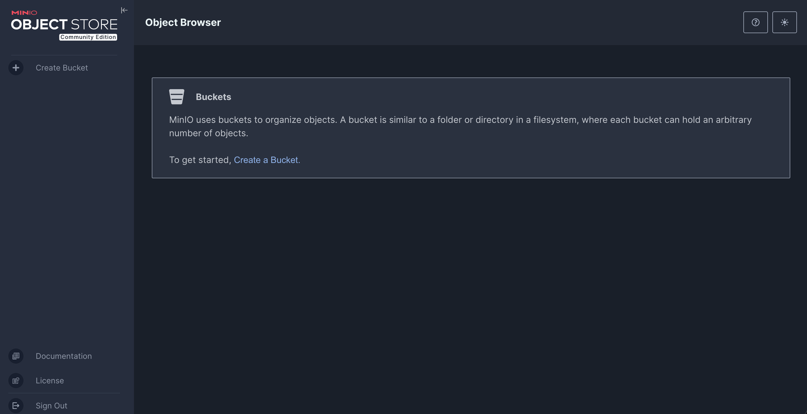
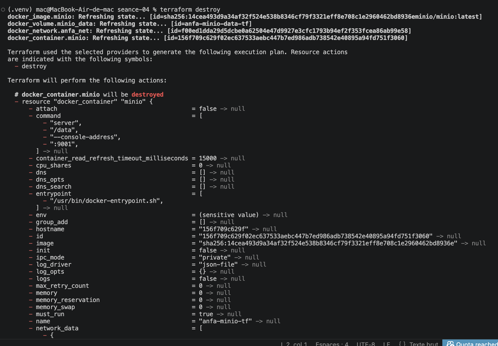

# Rendu - Séance 4

**Nom et prénom :** BIKOZI Balakibawi Sylvain
**Identifiant GitHub :** sbk6

## Résumé de la séance

Terraform installé via Homebrew sur macOS M2. Infrastructure Docker complète (réseau `anfa-network`, volume `anfa-minio-data-tf`, conteneur MinIO) décrite en HCL avec le provider `kreuzwerker/docker`. Workflow `init → plan → apply → destroy` maîtrisé, state Terraform compris et exclu de Git via `.gitignore`. Code refactorisé avec `variables.tf` et `terraform.tfvars`.

## Étapes principales

1. Installation de Terraform (`brew install terraform`) et vérification avec `terraform version`.
2. Écriture du premier `main.tf` minimal (image + conteneur MinIO), `terraform init` pour télécharger le provider Docker.
3. Maîtrise du workflow `init` → `plan` → `apply` → `destroy` : création et suppression du conteneur uniquement via du code.
4. Observation du fichier `terraform.tfstate` (JSON contenant l'état complet avec secrets en clair) et mise en place du `.gitignore` Terraform.
5. Passage à la stack complète : réseau + volume + conteneur MinIO, test de changement incrémental (modification du mot de passe → recréation du conteneur uniquement, volume conservé).
6. Refactoring : extraction des valeurs hardcodées dans `variables.tf`, création de `terraform.tfvars` (ignoré par Git) et `terraform.tfvars.example` (versionné).

## Captures d'écran

### terraform plan (création initiale)


### terraform apply réussi


### Console MinIO créée par Terraform


### terraform destroy


## Réponses aux exercices d'application

### Exercice 1 — QCM conceptuel

**1.1** B - L'IaC ne remplace pas la nécessité de comprendre l'infrastructure sous-jacente : elle automatise sa description, mais le praticien doit toujours comprendre ce qu'il code.

**1.2** B - Le déclaratif décrit l'état souhaité (« je veux 3 réplicas ») ; l'impératif décrit la séquence d'actions à effectuer (« crée d'abord X, puis Y »).

**1.3** B - Une opération idempotente produit le même résultat quel que soit le nombre de fois où elle est appliquée : appliquer deux fois `terraform apply` sans changer le code ne modifie rien.

**1.4** B - Un provider est un plugin qui sait communiquer avec une API spécifique (AWS, Docker, Kubernetes…) ; il traduit le HCL en appels API concrets.

**1.5** B - Terraform compare le state (état actuel) au code (état souhaité), ne voit aucun écart, et n'effectue aucune action : c'est l'idempotence.

**1.6** C - `terraform.tfstate` mémorise ce que Terraform a créé (IDs, configurations, secrets) pour pouvoir suivre les changements incrémentaux.

**1.7** B - Il ne faut jamais committer `terraform.tfstate` car il peut contenir des secrets en clair (mots de passe, clés API) et peut être corrompu par des commits concurrents en équipe.

**1.8** C - `terraform plan` affiche ce que Terraform compte faire sans rien changer ; c'est le réflexe à avoir avant tout `apply`.

**1.9** B - OpenTofu est un fork open source de Terraform créé par la Linux Foundation après le changement de licence de HashiCorp (BSL) en août 2023.

**1.10** B - Terraform et Ansible sont complémentaires : Terraform provisionne l'infrastructure (crée les VMs, réseaux, buckets), Ansible configure les machines existantes (installe des logiciels, déploie des configs).

---

### Exercice 2 — Lecture et interprétation d'un fichier Terraform

**2.1 — Les 4 resources définies :**

| Resource | Ce qu'elle fait |
|---|---|
| `docker_network "back"` | Crée un réseau Docker nommé `anfa-backend` pour isoler les conteneurs |
| `docker_volume "data"` | Crée un volume nommé `postgres-data` pour persister les données PostgreSQL |
| `docker_image "postgres"` | Télécharge l'image Docker `postgres:15` localement |
| `docker_container "db"` | Lance un conteneur PostgreSQL attaché au réseau et au volume, exposant le port 5432 |

**2.2 — `docker_image.postgres.image_id` :**

Cette expression référence l'attribut `image_id` de la resource `docker_image` nommée `postgres`. L'avantage sur `image = "postgres:15"` directement est double : Terraform crée d'abord l'image puis le conteneur (dépendance implicite garantissant l'ordre de création), et l'`image_id` pointe vers le SHA256 exact de l'image tirée, ce qui évite toute ambiguïté si le tag `latest` ou `15` est mis à jour entre deux applies.

**2.3 — Ordre de création lors du premier `terraform apply` :**

Terraform construit un graphe de dépendances et crée dans l'ordre :
1. `docker_network.back` et `docker_volume.data` en parallèle (aucune dépendance entre eux)
2. `docker_image.postgres` (peut aussi être en parallèle avec les deux précédents)
3. `docker_container.db` en dernier (dépend des trois resources précédentes via les références `docker_image.postgres.image_id`, `docker_volume.data.name`, `docker_network.back.name`)

**2.4 — Problème de sécurité :**

Le mot de passe `POSTGRES_PASSWORD=secret123` est en clair dans le code source, donc versionné dans Git. Il faut l'extraire dans une variable sensible :

```hcl
variable "postgres_password" {
  description = "Mot de passe PostgreSQL"
  type        = string
  sensitive   = true
}

# Dans docker_container.db, remplacer :
env = [
  "POSTGRES_DB=anfa",
  "POSTGRES_USER=anfa_user",
  "POSTGRES_PASSWORD=${var.postgres_password}",
]
```

La valeur réelle est placée dans `terraform.tfvars` (exclu du Git via `.gitignore`).

**2.5 — `terraform destroy` puis modification `external = 5433` puis `terraform apply` :**

Après `terraform destroy`, le state est vide (toutes les resources ont été supprimées). Lors du nouvel `apply`, Terraform voit que le state est vide alors que le code déclare 4 resources : il recrée tout depuis zéro. La modification `external = 5433` est simplement prise en compte lors de cette recréation ; le nouveau conteneur écoutera sur le port 5433 de l'hôte.

---

### Exercice 3 — Diagnostic

**3.1 — L'apply qui échoue avec une dépendance circulaire**

**a. Signification de l'erreur :** L'erreur `Cycle: docker_container.a, docker_container.b` signifie que Terraform a détecté une dépendance circulaire : `a` dépend de `b` (via `${docker_container.b.name}`) et `b` dépend de `a` (via `${docker_container.a.name}`), formant un cycle impossible à résoudre.

**b. Pourquoi Terraform refuse :** Terraform construit un DAG (graphe orienté acyclique) de dépendances pour déterminer l'ordre de création. Un cycle brise l'acyclicité : il est impossible de créer `a` avant `b` et `b` avant `a` simultanément.

**c. Solution :** Supprimer la référence circulaire. Si les conteneurs ont besoin de se connaître, utiliser des valeurs statiques ou un service de découverte. Par exemple, si `b` a juste besoin du nom de `a` mais pas l'inverse :

```hcl
resource "docker_container" "a" {
  name  = "container-a"
  image = "alpine"
  env   = ["LINKED_TO=container-b"]  # valeur statique, plus de référence
}

resource "docker_container" "b" {
  name  = "container-b"
  image = "alpine"
  env   = ["LINKED_TO=${docker_container.a.name}"]  # une seule direction
}
```

---

**3.2 — Le plan qui veut tout recréer**

**a. Pourquoi `-/+` (destroy + recreate) plutôt que `~` (update in-place) ?**

Docker ne permet pas de modifier les variables d'environnement d'un conteneur en cours d'exécution. Le provider Terraform Docker le sait : tout changement dans `env` est marqué comme `forces replacement`. Terraform doit donc supprimer l'ancien conteneur et en créer un nouveau avec la nouvelle configuration.

**b. Les données du volume seront-elles perdues ?**

Non. Le volume Docker (`docker_volume`) est une resource indépendante du conteneur dans Terraform. Lors de la recréation (`-/+`), seul le conteneur est détruit puis recréé ; le volume n'est pas touché. Le nouveau conteneur se remonte sur le même volume et retrouve toutes les données.

**c. Gratuite en production ?**

Non, cette opération a un impact opérationnel : pendant la destruction + recréation du conteneur, le service est **indisponible** (downtime). En production, cela peut causer des erreurs 503 pour les clients, des timeouts de connexion, et des pertes de requêtes en vol. Pour y remédier, on utilise des stratégies comme le blue/green deployment ou on place le service derrière un load balancer pour dérouter le trafic pendant la recréation.

---

**3.3 — Le state corrompu**

**a. Problème de sécurité immédiat :**

Le fichier `terraform.tfstate` contient des secrets en clair (mots de passe, clés API, tokens). En le poussant sur GitHub, ces secrets deviennent accessibles à toute personne ayant accès au dépôt (et potentiellement à des crawlers publics si le repo est public). Même en supprimant le fichier ensuite, il reste dans l'historique Git.

**b. Risque technique quand Awa applique avec ce state récupéré :**

Le state récupéré par Awa décrit des resources qui existent sur la machine de l'étudiant initial, mais pas forcément sur celle d'Awa. Si Awa lance `terraform apply`, Terraform croit que ces resources existent déjà (state non vide) et peut : tenter de les modifier (erreur si les IDs Docker sont invalides), ou dans le pire cas, détecter un écart entre state et code et **supprimer des resources** de la machine de l'étudiant initial si les deux partagent un backend distant.

**c. Solution pérenne :**

Utiliser un **remote backend** partagé (Terraform Cloud, S3 + DynamoDB, GitLab-managed state, etc.) qui stocke le state de façon centralisée, chiffrée, et avec verrouillage automatique (locking) pour éviter les modifications concurrentes. Le fichier `terraform.tfstate` n'existe alors plus en local. On ajoute aussi `*.tfstate` dans le `.gitignore` pour éviter les accidents.

---

### Exercice 4 — Adaptation Compose → Terraform

```hcl
terraform {
  required_providers {
    docker = {
      source  = "kreuzwerker/docker"
      version = "~> 3.0"
    }
  }
}

provider "docker" {}

variable "minio_root_password" {
  description = "Mot de passe administrateur MinIO"
  type        = string
  sensitive   = true
}

# Réseau partagé (équivalent du réseau implicite Compose)
resource "docker_network" "anfa_net" {
  name = "anfa-network"
}

# Volume pour les données MinIO
resource "docker_volume" "minio_data" {
  name = "minio-data"
}

# Images
resource "docker_image" "minio" {
  name = "minio/minio:latest"
}

resource "docker_image" "jupyter" {
  name = "jupyter/scipy-notebook:latest"
}

# Conteneur MinIO
resource "docker_container" "minio" {
  name    = "anfa-minio"
  image   = docker_image.minio.image_id
  command = ["server", "/data", "--console-address", ":9001"]

  ports {
    internal = 9000
    external = 9000
  }
  ports {
    internal = 9001
    external = 9001
  }

  env = [
    "MINIO_ROOT_USER=anfa-admin",
    "MINIO_ROOT_PASSWORD=${var.minio_root_password}",
  ]

  volumes {
    volume_name    = docker_volume.minio_data.name
    container_path = "/data"
  }

  networks_advanced {
    name = docker_network.anfa_net.name
  }

  lifecycle {
    ignore_changes = [log_opts]
  }
}

# Conteneur Jupyter
# Terraform crée minio avant jupyter automatiquement
# car jupyter référence docker_network.anfa_net (même dépendance)
resource "docker_container" "jupyter" {
  name  = "anfa-jupyter"
  image = docker_image.jupyter.image_id

  ports {
    internal = 8888
    external = 8888
  }

  env = [
    "JUPYTER_TOKEN=anfa-token",
  ]

  networks_advanced {
    name = docker_network.anfa_net.name
  }

  lifecycle {
    ignore_changes = [log_opts]
  }
}
```

---

### Exercice 5 — Mini-cas d'architecture

**5.1 — Au moins 4 types de resources Terraform pour l'infrastructure cloud d'Anfa chez OVHcloud :**

1. **Un bucket de stockage objet** — pour stocker les CSV du référentiel et les logs GPS (souveraineté des données chez OVHcloud).
2. **Un cluster Kubernetes managé** — pour héberger les workloads Spark (avec autoscaling pour les heures de pointe) et le dashboard Grafana.
3. **Un réseau privé virtuel (VPC/vRack)** — pour isoler et sécuriser la communication entre les services de la plateforme.
4. **Un load balancer public** — pour exposer le dashboard Grafana à Internet et le rendre accessible depuis n'importe quel téléphone.
5. (Bonus) **Un groupe de sécurité / firewall** — pour contrôler les flux entrants/sortants vers les différents services.

**5.2 — Approche B recommandée (fichiers séparés) :**

Je recommande l'approche **B** (plusieurs fichiers séparés). Un fichier `main.tf` de 800 lignes est difficile à lire, à revoir en code review et à maintenir : trouver une resource réseau au milieu d'un fichier de storage et de compute est contre-productif. Les fichiers séparés (`network.tf`, `storage.tf`, `compute.tf`, `monitoring.tf`) permettent à chaque membre de l'équipe de travailler sur son périmètre sans conflits Git, facilitent la navigation dans le code et rendent les changements incrémentaux plus lisibles dans les diffs.

**5.3 — Deux mécanismes pour gérer dev et prod :**

1. **Fichiers `.tfvars` distincts** : `terraform.dev.tfvars` et `terraform.prod.tfvars` contenant les valeurs spécifiques à chaque environnement (taille de cluster, noms de buckets, mots de passe). On applique avec `terraform apply -var-file=terraform.prod.tfvars`.

2. **Workspaces Terraform** : `terraform workspace new dev` / `terraform workspace new prod` permettent de maintenir un state séparé par environnement avec la même définition de code, en utilisant `${terraform.workspace}` dans les noms de resources pour les différencier.

**5.4 — Migration OVHcloud → AWS :**

La migration ne sera **pas triviale**. Ce qui se transpose facilement : la logique des variables, la structure des fichiers, les concepts (réseau, volume, conteneur) restent les mêmes. Ce qui demande du travail : toutes les resources devront être réécrites avec les types du provider AWS (`aws_s3_bucket` au lieu du bucket OVH, `aws_eks_cluster` au lieu du cluster OVH Kubernetes, `aws_lb` au lieu du load balancer OVHcloud, etc.). Les noms, attributs et comportements des resources sont propres à chaque provider ; il n'existe pas de migration automatique. Il faut compter plusieurs jours à semaines selon la taille de l'infrastructure, sans parler de la migration des données elles-mêmes hors du périmètre Terraform.

**5.5 — 3 bonnes pratiques pour une équipe de 4 personnes :**

1. **Remote backend partagé avec locking** (Terraform Cloud, S3 + DynamoDB) : le state n'est jamais en local ni dans Git, et le verrouillage automatique empêche deux personnes d'appliquer simultanément et de corrompre le state.

2. **`terraform plan` obligatoire en code review via CI/CD** : chaque PR déclenche automatiquement un `terraform plan` et affiche le diff d'infrastructure proposé. Personne ne peut merger sans que l'équipe ait validé visuellement ce qui sera créé, modifié ou supprimé.

3. **`.gitignore` strict + `*.tfvars` exclus + fichier `.example` versionné** : aucun secret (mots de passe, clés API) ne peut accidentellement atterrir dans le dépôt Git. Le fichier `.example` documente quelles variables fournir sans exposer les valeurs réelles.

---

## Difficultés rencontrées

Le piège du `lifecycle { ignore_changes = [log_opts] }` : sans ce bloc, Docker Desktop injecte des options de log par défaut absentes du code HCL, ce qui amène Terraform à proposer de recréer le conteneur à chaque `plan` alors qu'aucun changement n'a été fait. Ce comportement casse l'idempotence et peut surprendre ; le snippet du gist l'inclut déjà pour cette raison.
