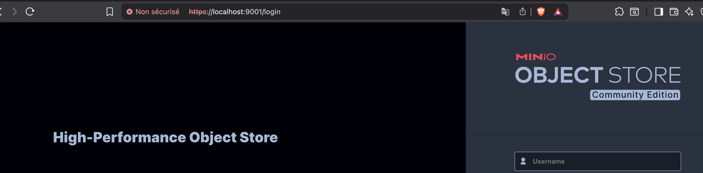
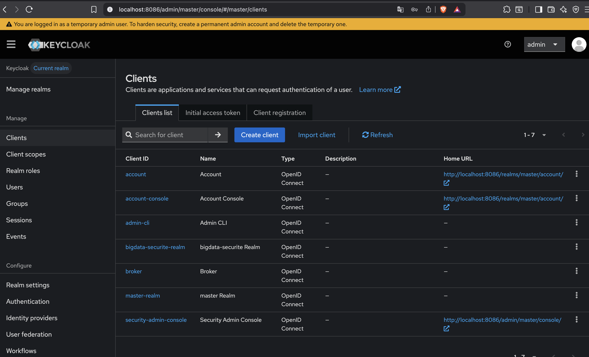
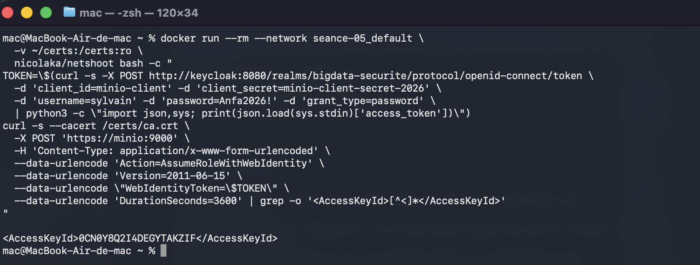
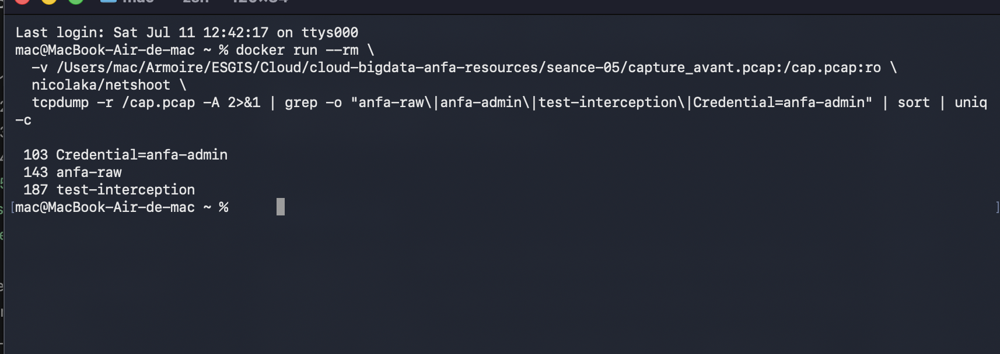
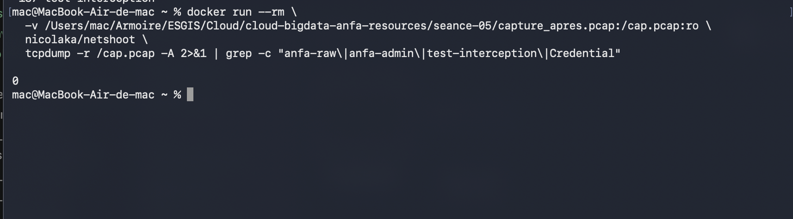

# Rendu — Big Data & Sécurité · LAB 1 : Durcissement du stockage distribué

**Nom et prénom :** BIKOZI Balakibawi Sylvain
**Identifiant GitHub :** sbk6
**Date de soumission :** 11/07/2026

---

## Résumé du lab

Le cluster MinIO + Spark de la séance 05 a été durci selon deux axes complémentaires :
chiffrement des flux réseau par TLS (certificat signé par une CA locale) et authentification
fédérée par Keycloak 26.6 via le protocole OIDC. La comparaison des captures réseau avant et
après démontre concrètement le passage d'un trafic en clair (credentials exposés) à un trafic
opaque (TLS 1.3).

---

## Étapes réalisées

### Étape 2.1 — État initial & sauvegarde
- Inventaire des services actifs : `anfa-minio`, `anfa-spark-master`, `anfa-spark-worker-1/2`.
- Sauvegarde : `docker-compose.yml.bak` + archive `minio_data.tar.gz`.

### Étape 2.2 — Capture trafic AVANT TLS (menace STRIDE : Information Disclosure)
- `tcpdump` lancé en mode `--net container:anfa-minio` avec `nicolaka/netshoot`.
- Job Spark soumis via HTTP → bucket `anfa-raw`, chemin `test-interception`, clé `anfa-admin` visibles en clair.
- **Capture sauvegardée** : `capture_avant.pcap`

### Étape 2.3 — Mise en place TLS sur MinIO
- CA locale créée avec `openssl` (`CN=Cluster-CA-LOCAL`).
- Certificat serveur signé (`CN=minio`) **avec SANs** : `DNS:minio`, `DNS:localhost`, `IP:127.0.0.1`.
- Fichiers copiés sous les noms requis par MinIO : `public.crt` / `private.key` dans `~/certs/`.
- Volume `~/certs:/root/.minio/certs:ro` monté dans le service MinIO.
- Vérification : `openssl s_client -connect localhost:9000 -CAfile ~/certs/ca.crt` → `Verify return code: 0 (ok)`.

### Étape 2.4 — Authentification OIDC via Keycloak
- Service Keycloak 26.6 ajouté dans `docker-compose.yml` (port 8086).
- Realm `bigdata-securite`, client confidentiel `minio-client`, utilisateur `sylvain`.
- **Mapper Keycloak** : claim hardcodé `policy=readwrite` (requis par MinIO STS).
- Configuration OIDC activée dans MinIO via `mc admin config set identity_openid`.
- Test `AssumeRoleWithWebIdentity` → `AccessKeyId` retourné avec succès.

### Étape 2.5 — Capture trafic APRÈS TLS
- Truststore JKS créé (`keytool -importcert`) avec la CA locale.
- `tcpdump` relancé, trafic HTTPS généré vers MinIO.
- **Aucune string sensible** dans `capture_apres.pcap` (bucket, chemin, credentials chiffrés).
- **Capture sauvegardée** : `capture_apres.pcap`

---

## Comparaison avant / après

| Élément observable       | `capture_avant.pcap` (HTTP) | `capture_apres.pcap` (HTTPS/TLS) |
|--------------------------|-----------------------------|-----------------------------------|
| Bucket S3                | `anfa-raw` visible          | Absent (chiffré)                  |
| Chemin de l'objet        | `test-interception` visible | Absent (chiffré)                  |
| Credential AWS           | `Credential=anfa-admin/...` | Absent (chiffré)                  |
| Verbe HTTP               | `GET /`, `PUT /` visibles   | Absent (données opaques)          |
| Protocole négocié (ALPN) | –                           | `http/1.1` (extension TLS, normal)|

**Menace STRIDE mitigée** : *Information Disclosure* (T3) — un attaquant sur le réseau
Docker ne peut plus intercepter les secrets de stockage.

---

## Captures d'écran

### MinIO console accessible en HTTPS (cadenas TLS)

### Keycloak — Realm bigdata-securite, client minio-client

### Réponse STS AssumeRoleWithWebIdentity (AccessKeyId obtenu)

### Strings lisibles dans capture_avant.pcap (trafic en clair)

### Absence de strings dans capture_apres.pcap (trafic chiffré)

---

## Réflexion personnelle

La principale difficulté technique rencontrée a été l'**issuer mismatch** entre Keycloak et
MinIO : le token demandé via `localhost:8086` portait un `iss` différent de ce que MinIO voyait
en interrogeant `keycloak:8080`. La solution a été de demander le token depuis l'intérieur du
réseau Docker, garantissant la cohérence de l'émetteur. Par ailleurs, les certificats TLS sans
SANs étaient rejetés par Go (runtime de MinIO et de mc) depuis 2021, ce qui a nécessité de
régénérer les certificats avec les extensions `subjectAltName`.

Ce lab illustre que la sécurité du stockage distribué n'est pas juste une question de
permissions d'accès (IAM) mais aussi de **confidentialité des flux** : sans TLS, toute la
pile d'authentification AWS-SigV4 de MinIO est inopérante car un attaquant réseau peut voir
les signatures HMAC en transit et les rejouer sur un autre objet.

---

## Difficultés rencontrées

1. Certificat TLS sans SANs → `x509: certificate relies on legacy Common Name field` (fix : ajout des SANs via `openssl.cnf`).
2. Issuer mismatch Keycloak (`localhost:8086` vs `keycloak:8080`) → token rejeté par MinIO (fix : requête token depuis le réseau interne Docker).
3. `mc admin config set` avec `--insecure` insuffisant → monté la CA dans `~/.mc/certs/CAs/`.
4. Classe `S3AFileSystem` absente du classpath Spark → utilisation de `mc` pour la capture après TLS.
