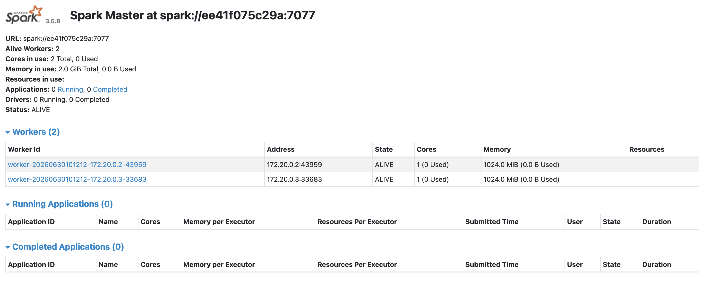
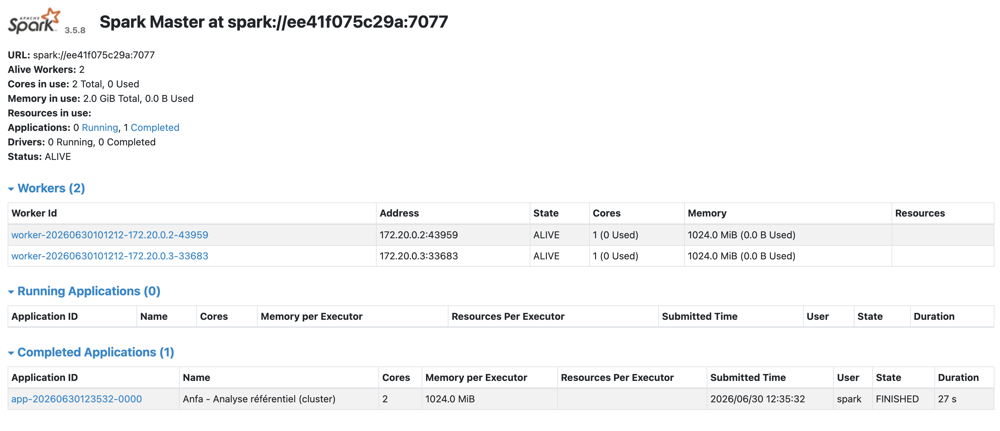
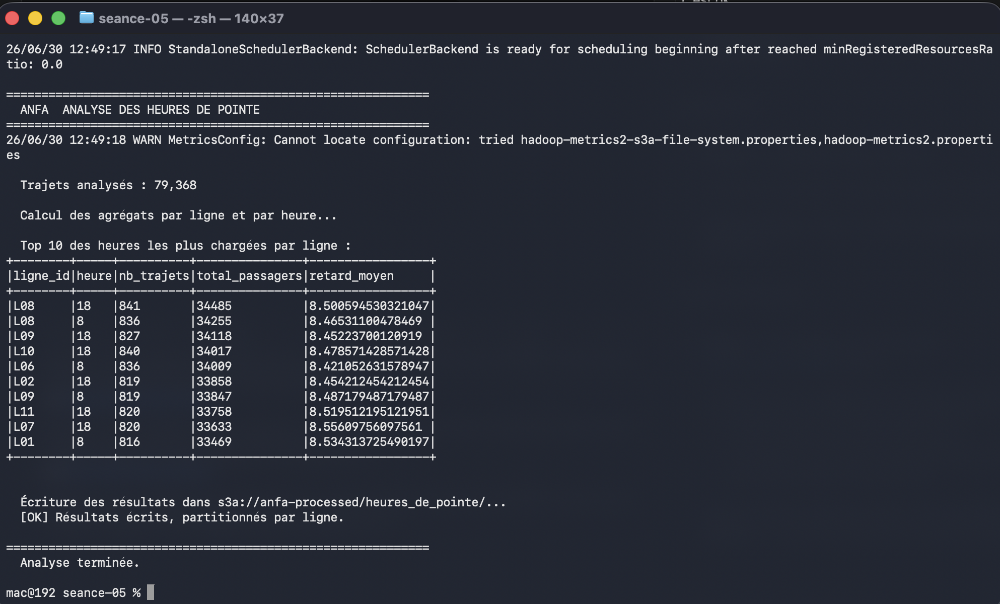
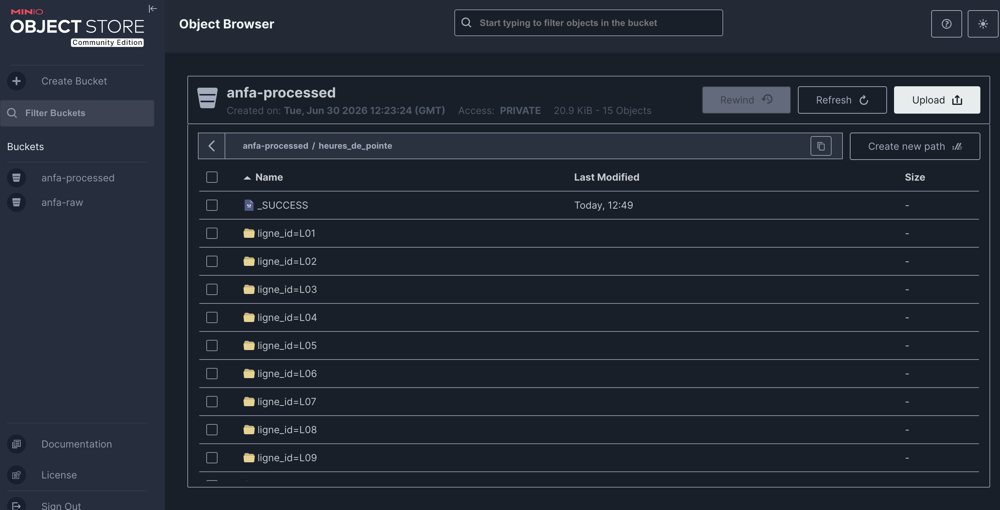

# Rendu : Séance 5

**Nom et prénom :** BIKOZI Balakibawi Sylvain
**Identifiant GitHub :** sbk6

## Résumé de la séance

Cluster Spark standalone (1 master + 2 workers) déployé via Docker Compose avec l'image officielle `apache/spark:3.5.8-python3`. Jobs PySpark distribués exécutés sur le cluster : lecture du référentiel Anfa depuis MinIO via le connecteur S3A, calcul de statistiques (lignes, arrêts, bus actifs, capacité) et des heures de pointe à partir d'un historique simulé de 75 000 trajets. Résultats écrits en Parquet dans la zone `anfa-processed` (pattern data lake raw / processed). Comparaison mode local vs cluster : overhead supérieur au gain sur de petits volumes.

## Étapes principales

1. Synchronisation du fork avec l'upstream (`denisakp/cloud-bigdata-anfa-resources`) pour récupérer `seance-05/` (Compose + 4 jobs Python).
2. Déploiement du cluster Spark standalone (1 master + 2 workers) via `docker compose up -d`.
3. Création des buckets MinIO (`anfa-raw`, `anfa-processed`) et de la clé applicative via `mc`.
4. Upload du référentiel CSV dans `anfa-raw/referentiel/` (`upload_referentiel.py`).
5. Soumission du premier job distribué (`analyse_referentiel_cluster.py`) via `spark-submit` : lecture S3A, stats, écriture Parquet.
6. Génération d'un historique simulé de trajets (`generer_trajets.py`) puis job d'analyse des heures de pointe (`heures_de_pointe.py`) avec groupBy/shuffle et partitionnement Parquet par ligne.
7. Observation de l'exécution dans l'UI Spark Master (http://localhost:8080).

## Captures d'écran

### Dashboard Spark Master avec 2 workers ALIVE

### Application Spark terminée (Completed Applications)

### Top 10 des heures de pointe dans la console

### Bucket anfa-processed avec heures_de_pointe/ partitionné par ligne_id

## Réflexion : local vs cluster

Sur 75 000 trajets, le mode cluster est **plus lent** que le mode local (~10-15 s contre ~5-10 s) : l'overhead de sérialisation et de communication entre le Driver et les Executors (2 workers à 1 cœur / 1 Go chacun) dépasse le gain du parallélisme sur ce volume. Le cluster devient bénéfique à partir d'environ **1 million de lignes**, et indispensable quand les données dépassent la RAM d'une seule machine (mode local → OOM à 100 millions de lignes, cluster → ~5-10 min).

- **Mode local** : développement, debug, exploration, jeux de données < 1 Go.
- **Mode cluster** : production, volumes > 1 Go, besoin de tolérance aux pannes ou de scalabilité horizontale.

## Bonus Spark sur Kubernetes

Réalisé : non.

## Difficultés rencontrées

Le conteneur `apache/spark` fait tourner les workers sous un utilisateur sans répertoire home (`/nonexistent`), ce qui fait échouer `--packages` lors du premier `spark-submit`. Solution : ajouter `-e HOME=/tmp` au `docker exec` et `--conf spark.jars.ivy=/tmp/.ivy2` à `spark-submit` pour rediriger le cache Maven vers `/tmp`.
