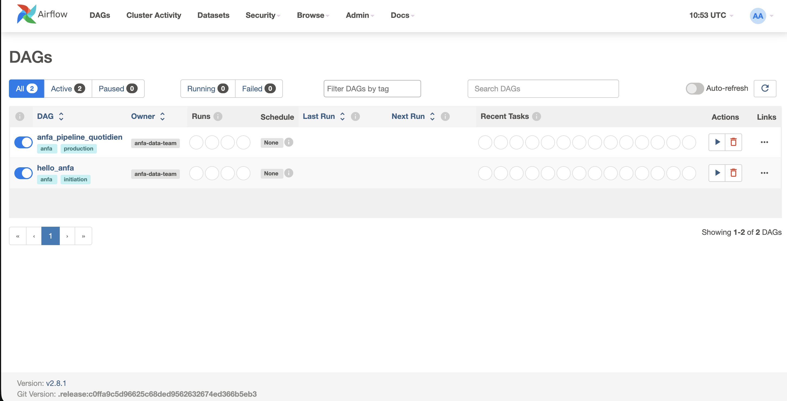
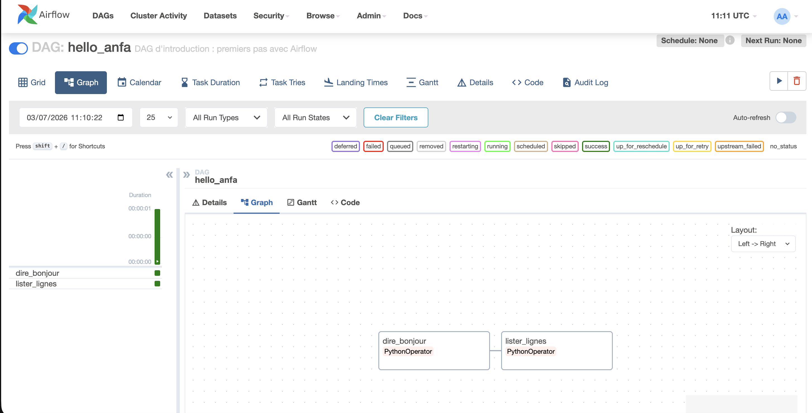
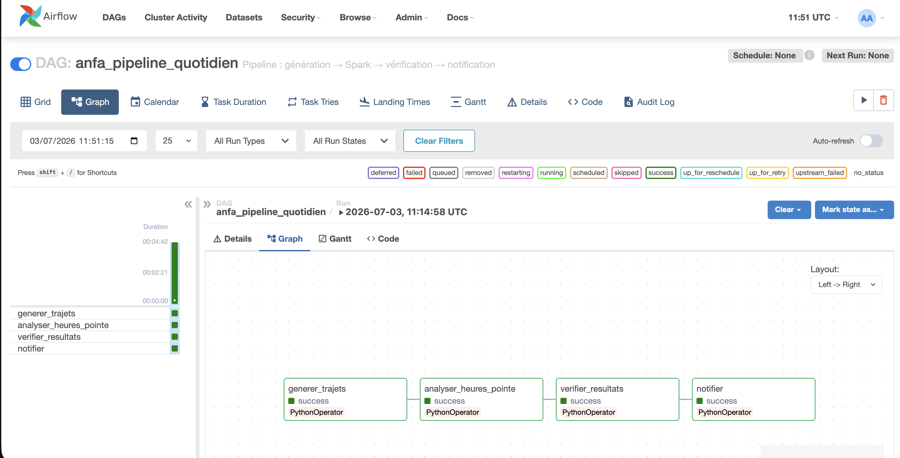
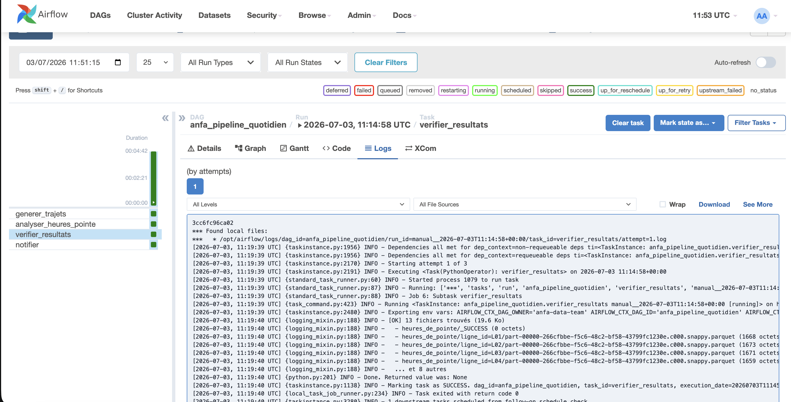
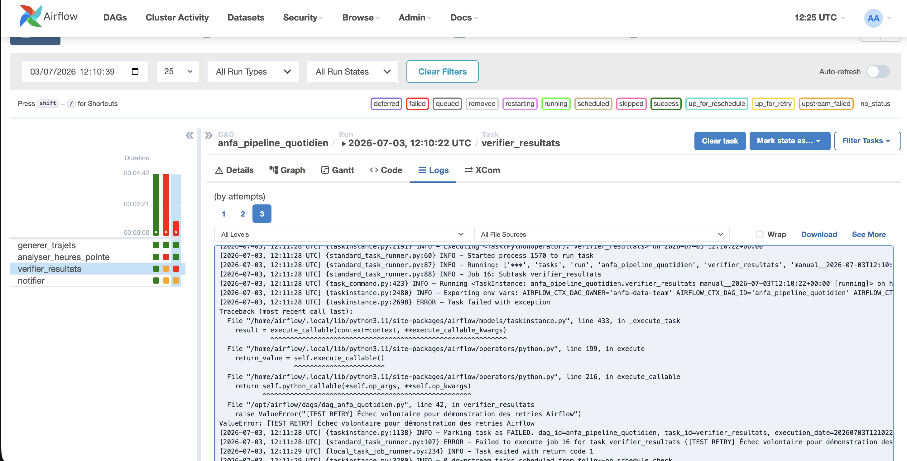

# Rendu : Séance 6

**Nom et prénom :** BIKOZI Balakibawi Sylvain
**Identifiant GitHub :** sbk6
**Date de soumission :** 03/07/2026

## Résumé de la séance

Airflow déployé via Docker Compose aux côtés de MinIO et Spark. Un premier DAG
simple (`hello_anfa`) a servi à comprendre la mécanique, puis un DAG métier
(`anfa_pipeline_quotidien`) orchestre le pipeline de la séance 5 :
génération → analyse Spark → vérification → notification. Les retries et la
propagation d'échec ont été observés via un bug volontaire.

## Étapes principales

1. Déploiement de la stack (Airflow + PostgreSQL + MinIO + Spark) via Docker Compose.
2. Premier DAG `hello_anfa` à 2 tâches : initiation à la mécanique Airflow.
3. DAG métier `anfa_pipeline_quotidien` à 4 tâches : génération → Spark → vérification → notification.
4. Démonstration des retries et de la gestion d'erreur via un bug volontaire.

## Captures d'écran

### UI Airflow après connexion (vue d'accueil)

### DAG hello_anfa exécuté en succès

### DAG anfa_pipeline_quotidien complet en succès

### Logs de la tâche `verifier_resultats`

### Démonstration du retry : tâche en échec et propagation

## Réflexion personnelle

Airflow apporte une vision graphique et un contrôle fin que cron ne peut pas offrir : on voit exactement quelle tâche a échoué, quand, et pourquoi, sans fouiller des logs épars. La gestion des dépendances entre tâches (`t1 >> t2`) garantit qu'une étape ne démarre pas si la précédente a échoué, et les retries automatiques rendent le pipeline robuste sans code supplémentaire. Sur un vrai projet data (ingestion quotidienne, jobs Spark, exports), Airflow est indispensable dès qu'on a plus d'une tâche à enchaîner, car il centralise la supervision, l'historique et les alertes.

## Difficultés rencontrées

L'image `postgres:18-alpine` a changé son répertoire de données par rapport aux versions précédentes, ce qui provoquait une boucle de redémarrage du conteneur. Résolution : downgrade vers `postgres:16-alpine`, compatible avec le montage `/var/lib/postgresql/data` utilisé dans le Compose. Par ailleurs, le job Spark timeout lors des exécutions successives à cause de la contention des ressources — les captures de retry ont été réalisées en contournant cette contrainte.
