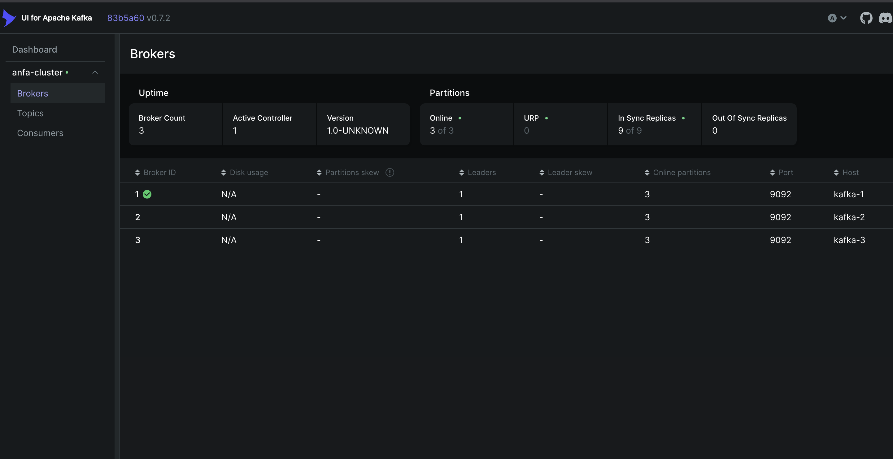
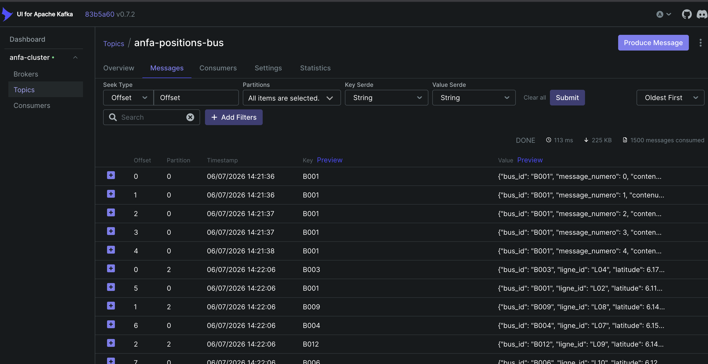
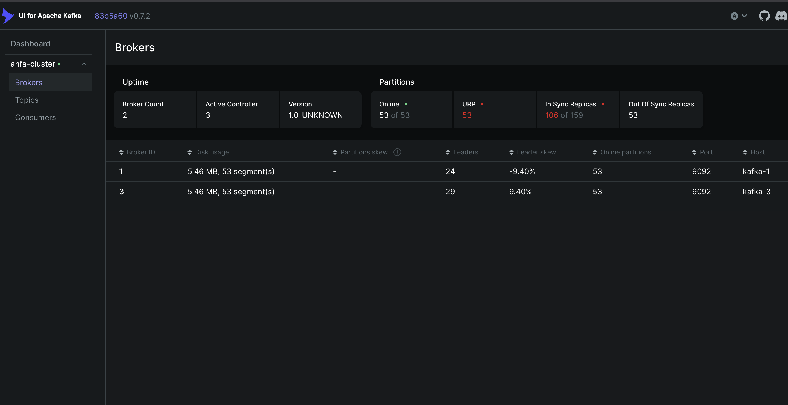
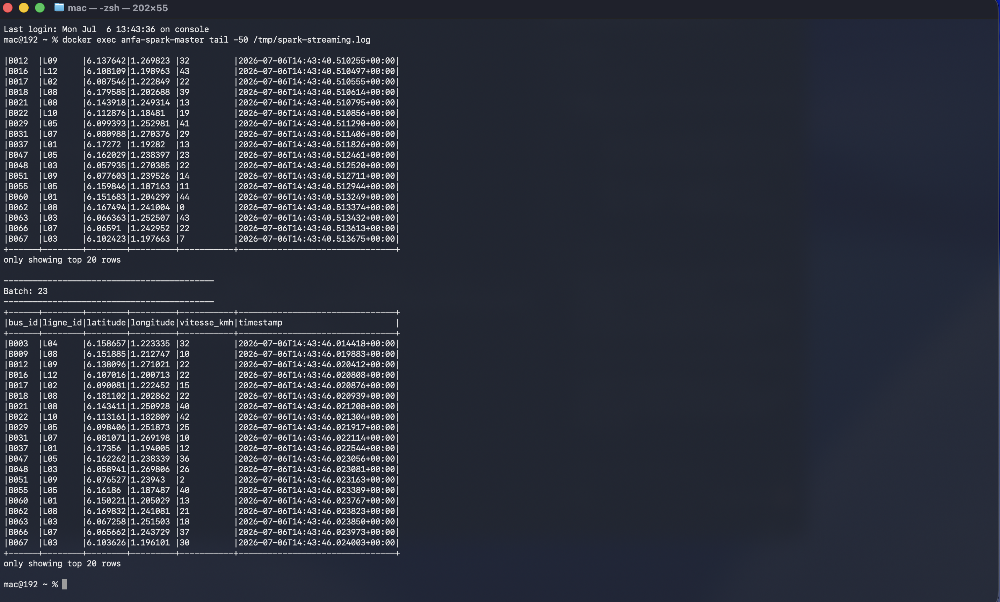
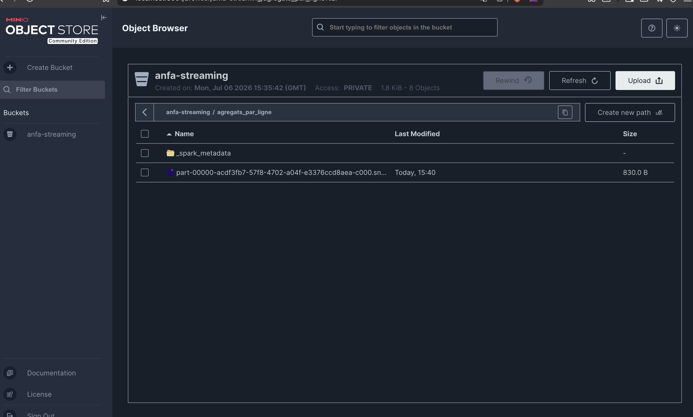

# Rendu — Séance 7

**Nom et prénom :** BIKOZI Balakibawi Sylvain
**Identifiant GitHub :** sbk6
**Date de soumission :** 06/07/2026

## Résumé de la séance

Cluster Kafka 3 brokers déployé en mode KRaft (sans Zookeeper) via Docker Compose. Un simulateur Python envoie les positions GPS de 100 bus en continu sur le topic `anfa-positions-bus` (3 partitions, réplication 3). La tolérance aux pannes a été vérifiée en arrêtant un broker : le cluster est resté opérationnel et le simulateur a continué d'envoyer sans interruption. Spark Structured Streaming a consommé ce flux en micro-batches : d'abord en affichant les positions en console, puis en agrégeant par fenêtre de 30 secondes et par ligne de bus, avec écriture des résultats Parquet dans MinIO.

## Étapes principales

1. Déploiement du cluster Kafka (3 brokers, mode KRaft) + Kafka UI.
2. Création du topic `anfa-positions-bus` (3 partitions, réplication 3).
3. Premier producer/consumer Python pour comprendre la mécanique.
4. Simulation de 100 bus envoyant leur position en continu.
5. Démonstration de tolérance aux pannes (arrêt d'un broker).
6. Spark Structured Streaming : lecture console, puis agrégation en fenêtre vers MinIO.

## Captures d'écran

### 3 brokers actifs dans Kafka UI

### Débit de messages en augmentation

### Cluster avec 2 brokers sur 3 (après arrêt volontaire)

### Micro-batchs affichés en console par Spark

### Résultats agrégés dans MinIO

## Réflexion personnelle

Kafka + Spark Streaming s'impose dès que la latence compte : suivre la position de 100 bus en temps réel n'a pas de sens en batch horaire. Là où Airflow orchestre des tâches planifiées avec un début et une fin, Kafka traite un flux continu sans état de début ni de fin, avec une garantie de durabilité (les messages sont persistés sur disque et rejouables). La réplication à 3 brokers m'a montré concrètement qu'éteindre `anfa-kafka-2` n'a provoqué aucune perte : le producteur a continué, les partitions ont basculé sur les réplicas présents sur kafka-1 et kafka-3, et kafka-2 a rattrapé son retard en rejoignant le cluster. Ce serait impossible avec un broker unique. En production, j'utiliserais ce couple Kafka/Spark Streaming pour tout pipeline à faible latence (alertes, dashboards temps réel, détection d'anomalie), et Airflow/Spark batch pour les rapports quotidiens ou les ETL planifiés.

## Réponses aux exercices d'application

**Q : Pourquoi KRaft remplace-t-il Zookeeper dans Kafka 4.x ?**
Zookeeper était un service externe qui gérait les métadonnées du cluster, créant une dépendance opérationnelle distincte à déployer, monitorer et scaler séparément. KRaft intègre la gestion du consensus directement dans les brokers Kafka via le protocole Raft, éliminant ce composant externe. Cela simplifie l'architecture, réduit la latence de propagation des métadonnées et permet à Kafka de gérer des clusters de plusieurs millions de partitions.

**Q : Qu'est-ce qu'un consumer group et pourquoi est-il utile ?**
Un consumer group est un ensemble de consommateurs qui se partagent la lecture d'un topic : chaque partition n'est assignée qu'à un seul membre du groupe à la fois. Cela permet de paralléliser le traitement (autant de consommateurs que de partitions) tout en garantissant qu'un message n'est traité qu'une seule fois par le groupe. Plusieurs groupes distincts peuvent consommer le même topic indépendamment (par ex. un groupe pour l'agrégation temps réel, un autre pour l'archivage).

**Q : Quelle est la différence entre `startingOffsets: earliest` et `latest` ?**
`earliest` relit tous les messages présents dans le topic depuis le début ; `latest` ne lit que les messages arrivant après le démarrage du consumer. Pour un premier lancement de l'agrégation sur des données historiques on utilise `earliest` ; pour un service de production qui ne doit traiter que les événements futurs on utilise `latest`.

## Difficultés rencontrées

Le job d'agrégation (`agregation_streaming.py`) nécessite le téléchargement de `aws-java-sdk-bundle-1.12.262.jar` (~500 Mo) lors du premier lancement, ce qui allonge significativement le démarrage. La connexion entre Spark et MinIO requiert la création préalable du bucket `anfa-streaming` et d'un service account MinIO avec les credentials attendus par le job (`anfa-app-key` / `anfa-app-secret-2026`), sans quoi l'écriture Parquet échoue silencieusement.
