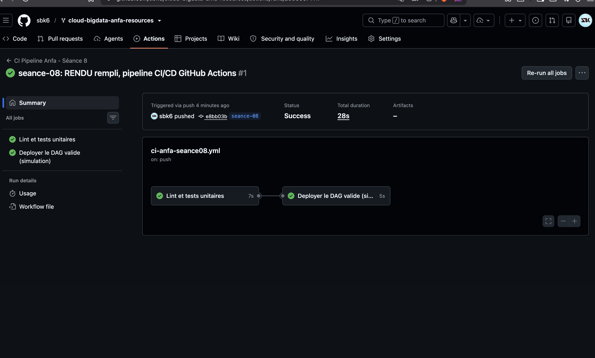
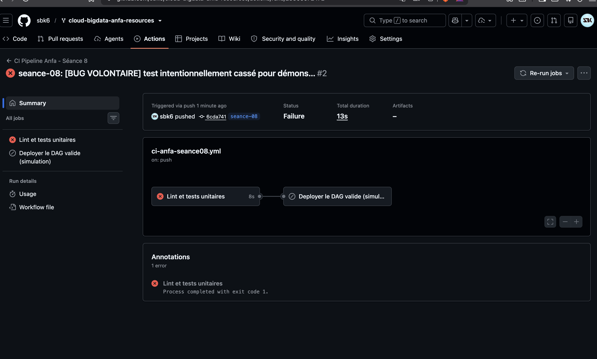

# Rendu — Séance 8

**Nom et prénom :** BIKOZI Balakibawi Sylvain
**Identifiant GitHub :** sbk6
**Date de soumission :** 06/07/2026

## Résumé de la séance

La logique métier du pipeline Anfa a été extraite dans `anfa_logic.py`, découplée d'Airflow et de boto3 pour être testable en isolation. Cinq tests unitaires avec pytest vérifient les cas nominaux et les cas d'erreur. Un pipeline CI/CD GitHub Actions exécute automatiquement le lint (flake8) et les tests à chaque push sur la branche, puis déclenche un déploiement simulé uniquement si tout est vert. Une démonstration avec un bug volontaire confirme que le job de déploiement est bien bloqué en cas d'échec des tests.

## Étapes principales

1. Séparation de la logique métier (`anfa_logic.py`) du DAG Airflow.
2. Écriture de 5 tests unitaires avec pytest.
3. Écriture du workflow GitHub Actions (lint + tests + déploiement simulé).
4. Démonstration : un bug volontaire bloque le déploiement ; correction et succès.

## Captures d'écran

### Workflow réussi (2 jobs)

### Job en échec, déploiement non exécuté

## Réflexion personnelle

Sans CI, un développeur peut pousser du code cassé directement en production — c'est exactement l'incident de Mawuli : un DAG déployé sans être testé, qui a planté silencieusement en production. Avec ce pipeline, le push lui-même aurait déclenché flake8 et pytest : si la moindre assertion avait échoué, le job `deployer` n'aurait jamais été atteint grâce à `needs: valider-dag`. Le mot-clé `needs:` crée une dépendance explicite entre jobs : le déploiement est conditionnel au succès du job de validation, et GitHub Actions refuse d'exécuter un job dont la dépendance est en échec. En pratique, cela garantit qu'aucun code non-vérifié ne part en production — ce que cron ou un script shell ne peut pas faire seul.

## Difficultés rencontrées

Aucune difficulté majeure. Le workflow utilise `actions/checkout@v6` et `actions/setup-python@v6` (versions récentes) — les versions v3/v4 mentionnées dans certaines documentations génèrent des avertissements de dépréciation.
