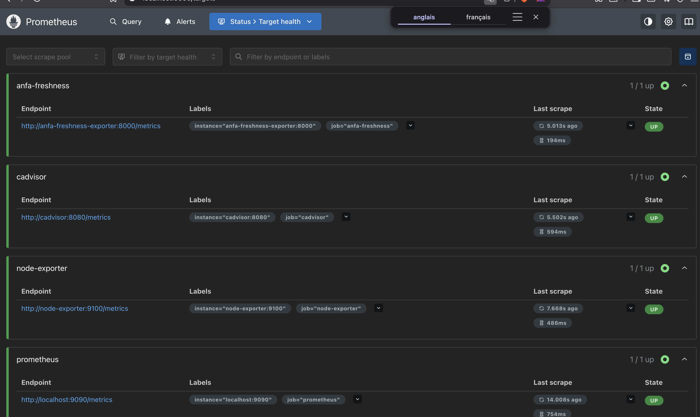
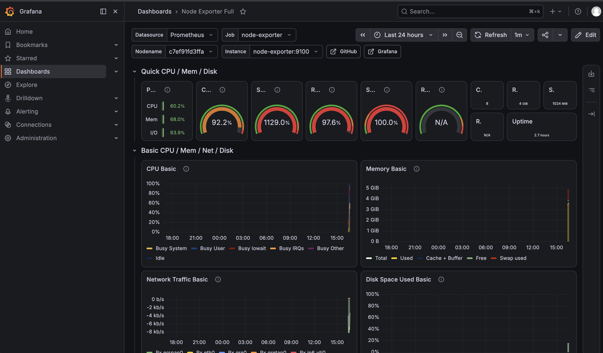
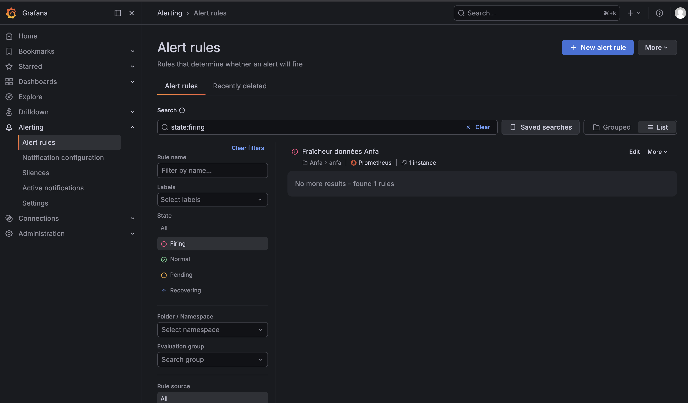

# Rendu — Séance 9

**Nom et prénom :** BIKOZI Balakibawi Sylvain
**Identifiant GitHub :** sbk6
**Date de soumission :** 06/07/2026

## Résumé de la séance

Stack de monitoring déployée via Docker Compose : Prometheus collecte les métriques de Node Exporter (machine hôte), cAdvisor (conteneurs Docker), et d'un exportateur métier custom qui expose la fraîcheur des données Anfa. Grafana visualise ces métriques et héberge les alertes. Le dashboard "Node Exporter Full" offre une vue complète des ressources système. Une alerte sur `anfa_dernier_traitement_timestamp` a été configurée pour détecter les pannes silencieuses du pipeline : dès que le fichier sentinelle `/tmp/anfa_en_panne` est créé dans le conteneur, l'horodatage cesse d'être mis à jour, la fraîcheur grimpe et l'alerte passe en état Firing.

## Étapes principales

1. Déploiement de Prometheus, Node Exporter, cAdvisor, Grafana et d'un exportateur
   métier custom (fraîcheur des données Anfa).
2. Exploration des cibles Prometheus et premières requêtes PromQL.
3. Import du dashboard "Node Exporter Full" et construction d'un panneau custom.
4. Configuration d'une alerte Grafana sur la fraîcheur des données.
5. Simulation d'une panne silencieuse et observation du déclenchement de l'alerte.

## Captures d'écran

### Les 4 cibles Prometheus à l'état UP

### Dashboard "Node Exporter Full" importé

### Alerte à l'état Firing après panne simulée

## Réflexion personnelle

La situation-problème d'Awa illustre le piège classique des pannes silencieuses : le pipeline s'arrêtait de produire sans générer d'erreur visible, tous les conteneurs restaient "Up", le CPU et la RAM étaient normaux. Les métriques d'infrastructure classiques (node_cpu_seconds_total, container_memory_usage_bytes) ne peuvent pas détecter ce type de panne car elles mesurent la santé de la machine, pas la logique métier. La métrique `anfa_dernier_traitement_timestamp` est une métrique de **fraîcheur** : elle répond à la question "quand le pipeline a-t-il produit un résultat pour la dernière fois ?" Si cette valeur ne change plus, peu importe que les conteneurs soient "Up" — le pipeline est en panne. C'est précisément ce qu'Awa n'avait pas : une alerte sur le silence du traitement plutôt que sur la mort d'un processus.

## Difficultés rencontrées

L'image `gcr.io/cadvisor/cadvisor:v0.52.0` est disponible uniquement en `linux/amd64`. Sur une machine Apple Silicon (arm64), cAdvisor peut ne pas démarrer ou tourner en mode émulation Rosetta, ce qui entraîne des performances dégradées. La cible reste néanmoins détectée par Prometheus. La configuration de l'alerte Grafana nécessite de bien choisir `For: 2m` (durée avant firing) et `Evaluate every: 30s` pour que l'alerte se déclenche en moins de 3 minutes après le début de la panne simulée.
